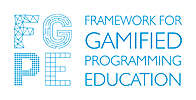

# FGPE Format Specifications

This repository contains the format specifications required for gamified programming exercises.

## Acknowledgments

This software has been developed as a part of the Framework for Gamified Programming Education project ([https://fgpe.usz.edu.pl/](https://fgpe.usz.edu.pl/)), co-funded by the Erasmus+ Programme of the European Union.

 

## License

